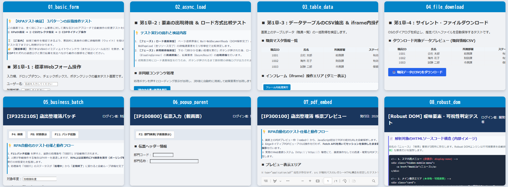

<h4 align="center">🚀 セットアップ (Getting Started)</h4>

<p align="right">
  更新日: 2026年9月27日<br>
  作成者: System beginner & AI Collaborator (Gemini)
</p>

#### 1.1 ディレクトリ構成

```text
📁
 ├── 📁 docs/                    # ドキュメント類
 ├── 📁 sample_BOX/
 ├── 📁 src_PowerShell/          # PowerShell モジュール( Core・基幹・拡張 )群
 ├── 📁 src_VBA/                 # Excel VBA用のクラスモジュールおよび連携インターフェース
 ├── 📁 sandbox/                 # テスト用ローカルHTML群
 │    ├── 01_basic_form.html             ( 標準Webフォーム操作とXPath/CSS/CDP比較 )
 │    ├── 02_async_load.html             ( 非同期要素の出現待機 ＆ ローディング非表示待機 )
 │    ├── 03_table_data.html             ( テーブルデータのCSV抽出 ＆ iframe操作テスト )
 │    ├── 03_frame_child.html            ( iframeテスト用の子ドキュメント )
 │    ├── 04_file_download.html          ( 標準的なファイルダウンロード制御 )
 │    ├── 05_business_batch.html         ( 業務システム特有のバッチ監視 ＆ 動的ポーリング待機 )
 │    ├── 06_popup_parent.html           ( 親画面からポップアップ子画面の呼び出し ＆ 復帰待機 )
 │    ├── 06_popup_child.html            ( ポップアップ子画面側の操作とガベージコレクション検証 )
 │    ├── 07_pdf_embed.html              ( Fetch APIによる内蔵PDFビューアからの裏側サイレント保存 )
 │    ├── 08_robust_dom.html             ( レスポンシブな隠し要素の回避・可視判定・証跡出力テスト )
 │    ├── 
 │    ├── 🚀 公開サイトでのテスト用
 │    ├──  10_shadow_dom .html           ( Shadow DOM 操作テスト )
 │    ├──  11_overlay_mask .html         ( 画面オーバーレイ（マスク）待機テスト )
 │    ├── 🚀 DevTools/ 画面情報エクスポート＆要素ピッカー
 │    ├──  12_scroll_shadow_dom .html    ( スクロール / Shadow DOM / モダンUI / 動的要素 )
 │    ├── 
 │    ├── sample_report.pdf              ( Fetchダウンロードテスト用のダミーPDFファイル )
 │    └── style_common.css               ( テスト用HTML共通のスタイル定義 )
 ├── 📁 Libs/                    # DLL配置用フォルダ(必須)
 └── 📊 sample_rpa_test.xlsm     # VBA ( テストシナリオ )
```

</details>

#### 🧪 sandbox（_ローカルHTMLでのテスト_）

<details>
  <summary>&emsp;🔍 <i>( <b>sandbox:</b> テストシナリオ：第1章・第2章 Screens ( 8画面 ) )</i></summary>

  

</details>

#### 1.2 RPA実行ルートフォルダ

```text
📁
 ├─ Ps_Engine_Core_v-.ps1            ( 司令塔・ルーター・Win32API/UIA一括ロード )
 │
 ├─ [基幹モジュール]    ( ブラウザ起動と通信に必須の4ファイル )
 │   ├─ Lib-WebJS_v-.ps1            ( ブラウザ全画面へのJS自動注入ユーティリティ )
 │   ├─ Lib-WebView2_Init_v-.ps1    ( ブラウザ画面生成・タブ管理 )
 │   ├─ Lib-WebView2_Native_v-.ps1  ( Native API通信 )
 │   └─ Lib-WebCDP_v-.ps1           ( WebSocket・CDP高速通信 )
 │
 ├─ [拡張モジュール]    (用途に応じた機能群)
 │   ├─ Lib-
 │
 ├ 📊 実行用マクロファイル.xlsm      ( VBA司令塔 )
 │
 ├── [ Libs ]                       ( WebView2関連DLL: Core, WinForms, Loader )
 ├── [ sandbox ]                    ( テスト用ローカルHTML群 )
 ├── [ Logs ]              *自動作成( 実行ログ・スクショ・証跡出力先 )
 ├── [ RPA_Downloads ]     *自動作成( テスト用ダウンロード出力先 )
 └── [ UserData ]          *自動作成( WebView2独立ユーザーデータフォルダ )
```

#### 1.3 外部依存ライブラリの準備
1. VBA-JSON v2.3.1 (**JsonConverter**) の準備<br>

> [!NOTE]
プロセス間通信におけるJSON解析のため、VBE（Visual Basic Editor）の参照設定にて Microsoft Scripting Runtime の有効化が必須です。
&emsp;&emsp;`[ツール]` -> [参照設定] -> Microsoft Scripting Runtime に✅<sub>(チェック)</sub>を入れてください。

2. WebView2をWinFormsで駆動させるための以下のDLLを libs フォルダに配置してください（NuGet等から取得してください）。<br>
* **Microsoft.Web.WebView2.Core.dll:**&emsp; (基本コア)
* **Microsoft.Web.WebView2.WinForms.dll:**&emsp; (UI表示用)
* **WebView2Loader.dll:**&emsp; (PC内のEdgeランタイム本体と接続する重要ファイル。PowerShellから直接ロードはされません。)<br>

 > [!NOTE]
   _同梱のツール 「**WebView2 DLL 自動セットアップ_xx**」 を実行することで自動で3つのDLLがダウンロードされ、**Libs** フォルダへ格納されます。（ *ときどき最新バージョンの確認は必要です）_

<details>
  <summary>&emsp;💻 <i>( <b>powershell:</b> WebView2 DLL 自動セットアップ )</i></summary>

```text
==================================================
 WebView2 DLL セットアップツール
==================================================
現在の実行ディレクトリ: C:\●●\RPA-TEST  /

【注意】ここはRPAプロジェクトのルートフォルダではない可能性があります。
　本来は 'sandbox' や 'Libs' フォルダが存在する階層で実行する必要があります。
このまま現在の場所に Libs フォルダを作成して処理を続行しますか？ (Y/N): y

--- WebView2 コンポーネント取得開始 ---
Target Version: 1.0.4022.49
1. Downloading WebView2 SDK from NuGet... [Success]
2. Extracting package... [Success]
3. Installing DLLs to Libs folder...
  -> Microsoft.Web.WebView2.Core.dll... [Done]
  -> Microsoft.Web.WebView2.WinForms.dll... [Done]
  -> WebView2Loader.dll... [Done]
4. Cleaning up temporary files... [Done]

セットアップ完了！
以下のファイルが C:\●●\RPA-TEST\Libs に配置されました:

Name                                Length
----                                ------
Microsoft.Web.WebView2.Core.dll     698248
Microsoft.Web.WebView2.WinForms.dll  38792
WebView2Loader.dll                  163208

Enterキーを押して終了してください...:
```

</details>

---

#### 2.1 [実行用マクロファイル]

```text
 ├📊 sample_rpa_test.xlsm    # VBA ( テストシナリオ )
 ├── Ps_Engine.cls                  ( プロセス通信とAPI実行を担うRPAエンジンのコアクラス )
 ├── JsonConverter                  ( VBA-JSON ) VBAでのJSON解析
 ├── Ps_Bridge.bas                  ( JSONパース・エラー変換などのVBA側ユーティリティ )
 │
 ├── Mod_RpaEngine_Common.bas       ( エンジンの初期化とテストの実行司令塔 ) / Test_rpaEngine
 │  ├─ Mod_Chapter1_Basics.bas        ( テストシナリオ：第1章 基礎操作 )
 │  └─ Mod_Chapter2_Business.bas      ( テストシナリオ：第2章 業務システム・応用操作 )
 │
 ├── Mod_RPA_Challengeデータ同梱.bas (RPAチャレンジ(たぶん 9～10秒台で完走)) / Test_RPAchallenge
 │
 ├── Mod_TestRun1_Base一般的な.bas ( 公開サイトでのテスト1 ) / Test_Run1_Base
 ├── Mod_TestRun2_Base少し高度.bas ( 公開サイトでのテスト2 ) / Test_Run2_Base
 │
 ├── フォーム
 ├── Mod_TestDevTools.bas          ( 画面情報エクスポート＆要素ピッカー ) / Test_DevTools
 └──
```

#### 3.1 [実行ログファイルの例]

```text
<2026-09-dd hh:26:10> <Info> [System] 情報: Browser/ Width-Height (1366) - (720) | DPR: 1
👉 VBA側から指定: If Not rpaEngine.StartEngine(sessionId, ENGINE_PATH, useCdpPort, True) Then
　                    <Info> [Engine] 実行: 関数名 | Params: { パラメータ }　/ False: パラメータを出力しない。
<2026-09-dd hh:26:10> <Info> [System] 情報: 開発モードスイッチ (True)
<2026-09-dd hh:26:10> <Info> [System] 情報: 通信モードスイッチ (9222)
<2026-09-dd hh:26:10> <Success> [System] 成功: モジュールをロード (Lib-WebJS_v301.ps1)
<2026-09-dd hh:26:10> <Info> [System] 開始: ブラウザシステムの初期化 ...
<2026-09-dd hh:26:10> <Success> [System] 成功: DLLロード (Microsoft.Web.WebView2.Core.dll Version: 1.0.4022.49)
<2026-09-dd hh:26:10> <Success> [System] 成功: DLLロード (Microsoft.Web.WebView2.WinForms.dll Version: 1.0.4022.49)
<2026-09-dd hh:26:10> <Info> [System] 起動モード: CDP有効 (Port: 9222)
<2026-09-dd hh:26:14> <Success> [System] 成功: WebView2エンジン初期化およびJS自動注入
<2026-09-dd hh:26:14> <Info> [System] 情報: 接続先ランタイム (Version: 151.0.4129.93)
<2026-09-dd hh:26:15> <Success> [System] 成功: モジュールをロード (Lib-WebView2_Init_v301.ps1)
<2026-09-dd hh:26:15> <Success> [System] 成功: モジュールをロード (Lib-WebView2_Native_v301.ps1)
<2026-09-dd hh:26:15> <Success> [System] 成功: モジュールをロード (Lib-WebAction_v301.ps1)
<2026-09-dd hh:26:15> <Success> [System] 成功: モジュールをロード (Lib-WebXPath_v301.ps1)
<2026-09-dd hh:26:15> <Success> [System] 成功: モジュールをロード (Lib-WebDebug_v301.ps1)
<2026-09-dd hh:26:15> <Success> [System] 成功: モジュールをロード (Lib-DesktopUIA_v301.ps1)
<2026-09-dd hh:26:15> <Success> [System] 成功: モジュールをロード (Lib-WebSafeAction_v301.ps1)
<2026-09-dd hh:26:15> <Success> [System] 成功: モジュールをロード (Lib-DevTools_v301.ps1)
<2026-09-dd hh:26:15> <Success> [System] 成功: モジュールをロード (Lib-WebCDP_v301.ps1)
<2026-09-dd hh:26:17> <Info> [System] 情報: CDPポート (9222) の状態 - Listen (127.0.0.1)
<2026-09-dd hh:26:18> <Info> [System] 情報: 親プロセス監視開始 (PID: 11632, Name: EXCEL)
👉 起動完了
<2026-09-dd hh:26:25> <Info> [Engine] 実行: Invoke-WebNavigation | Params: {"Url":"http://●●●"}
<2026-09-dd hh:26:25> <Info> [Engine] 実行: Wait-WebDocumentReady | Params: {"TimeoutSec":10}
<2026-09-dd hh:26:25> <Info> [P01] URL更新: http://●●●
👉 基本的に コマンドの実行、”エラー情報”等、必要以上にはログを出力しない。
```
