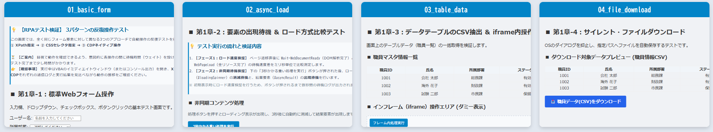
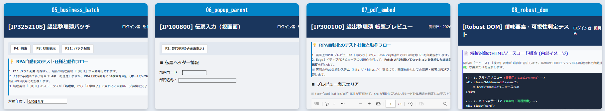

<h4 align="center">コードテスト（ローカルHTMLでのテスト 利用）</h4>

<p align="right">
  更新日: 2026年9月27日<br>
  作成者: System beginner & AI Collaborator (Gemini)
</p>

#### 🧪 sandbox（_ローカルHTML_）

RPA開発でよく遭遇する「ナゼかクリックできない？」「ナゼ終わるまで待ってくれないの？」といった、挙動を再現したローカルHTML群。

<details>
  <summary>&emsp;🔍 <i> <b>sandbox Screens: </b> 第一章：テスト画面 ( 01 ～ 04 )</i></summary>

  

</details>

<details>
  <summary>&emsp;🔍 <i> <b>sandbox Screens: </b> 第二章：テスト画面 ( 05 ～ 08 )</i></summary>

  

</details>

ローカルHTML（sandbox/01 ～ 08）、一部公開サイトに対し、VBAから各コンポーネントを呼び出し、その動作速度と安定性をミリ秒単位で実測・評価します。

* [T1] 基礎操作と待機 : <sub> XPath/CSSでの操作比較や、非同期通信（ローディングスピナー）の確実な出現/消滅待機。</sub>
* [T2-1] 疑似バッチ監視 : <sub> 業務システム特有の「操作不可マスク（グレーアウト）」の解除待機と、F4キー押下によるステータスポーリング制御。</sub>
* [T2-2] ポップアップ制御 : <sub> 親画面から子画面（別窓）を開き、選択後に自ら閉じた際（window.close）の親画面への自動フォーカス復帰。</sub>
* [T2-3] PDF裏側取得 : <sub> (embed) 表示されたPDFビューアに対し、UI操作に頼らずFetch APIを用いてセッションを維持したまま高速サイレント保存。</sub>
* [T2-4] Robust DOM : <sub> レスポンシブ特有の「裏側に隠れた非表示メニュー」を回避し、画面に見えている要素だけを狙撃する可視性判定テスト。</sub>

<details>
  <summary>&emsp;✅ <i>( --- VBA: テストシナリオ：第1章・第2章 --- )</i></summary>

```vba
    prompt = "シナリオを選んでください：" & vbCrLf & _
            "1. 【T1】  基礎・汎用コンポーネント動作テスト" & vbCrLf & _
            "2. 【T2-1】(SYS)：バッチ処理監視＆ポーリング制御" & vbCrLf & _
            "3. 【T2-2】親画面⇒ポップアップ子画面 制御" & vbCrLf & _
            "4. 【T2-3】Fetch APIによるPDFサイレントダウンロード" & vbCrLf & _
            "5. 【T2-4】(Robust)デバッグ証跡出力＆曖昧テキスト解析"
    ans = InputBox(prompt, "テストシナリオ選択")
    If ans = "" Then
        MsgBox "キャンセルされました。"
    Else
        MsgBox "選択したテストシナリオ: ( " & ans & " )"
    End If
```
</details>

`（1. sample_rpa_test.xlsm を開く。）`<br>
&emsp;2. Mod_RpaEngine_Common モジュール内の Test_rpaEngine マクロを実行。<br>
&emsp;3. ダイアログが表示されるので、実行したいテストシナリオ（第1章・第2章）の番号を入力すると操作テストが開始されます。

---

&emsp; 👉 [総合テスト・関数一覧表（ローカルHTMLでのテスト）](m03_Engine(%E9%96%A2%E6%95%B0TEST)%E3%83%AD%E3%83%BC%E3%82%AB%E3%83%ABhtml.md)&emsp;↗️ (docs/)

---

#### 【T1】 基礎操作と待機
**1. DOM操作：** / (テストコード 1/4) <br>
画面: **01_basic_form.html**<br>
全く同じフォーム要素に対して、「XPath指定」「CSSセレクタ指定」、そしてエンジン起動パラメータ useCdpPort=9222 を活かした「CDP経由のJSネイティブ実行」という、異なる3つのアプローチでアタック。

| <sub>操作対象</sub> | <sub>XPath指定例</sub> | <sub>CSSセレクタ指定例</sub> |
| :--- | :--- | :--- |
| <sub>テキスト入力</sub> | <sub>//input[@id=txtInput]</sub> | <sub>#txtInput</sub> |
| <sub>ドロップダウン</sub> | <sub>（※CSSまたはJS指定）</sub> | <sub>#selDept</sub> |
| <sub>チェックボックス</sub> | <sub>//input[@id=chkAgree]</sub> | <sub>#chkAgree</sub> |
| <sub>ボタンクリック</sub> | <sub>//button[@id='btnApply']</sub> | <sub>#btnApply</sub> |

**2. ページロード待機：** / (テストコード 2/4)<br>
画面: **02_async_load.html**<br>

PageLoad vs DocumentReady 2つの待機命令での、ミリ秒単位でベンチマークを測定します。

```vba
' --- DOM構造の解析完了のみを高速待機 (130.12 ms) ---
rpaEngine.RunAction "Wait-WebDocumentReady"

' --- 画像・全リソース・通信沈静化を含めて完全待機 (467.25 ms) ---
rpaEngine.RunAction "Wait-WebPageLoad"
```

_※ 注意：<sub>今回の再確認で、Wait-WebPageLoad の方が Wait-WebDocumentReady より速い結果となる時がありました。PC負荷、Jsコード（コード変更ありませんが、ロード方法は変更しています）の問題？。<sub>_<br>

💡 _使い分けの技術基準_
| <sub>待機コマンド</sub>  | <sub>平均所要時間</sub>  | <sub>判定基準</sub>  | <sub>最適な利用シーン</sub>  |
| :--- | :--- | :--- | :--- |
|  <sub>Wait-WebDocumentReady</sub> | <sub>~150 ms</sub> | <sub>document.readyState === 'complete'</sub> | <sub>高速処理、画像が重い画面、背景通信で「無限ロード」が発生する画面の回避</sub> |
|  <sub>Wait-WebPageLoad</sub> | <sub>~470 ms</sub> | <sub>全リソース読込＋Ajax沈静化</sub> | <sub>【原則デフォルト】 画面描画の完了を完全に保証したい遷移時</sub> |

**非同期UI：** Webシステムで多用される「処理中にぐるぐる回るスピナー（ローディング表示）」の消滅待機 Wait-WebElementInvisible を実装し、画面表示の「出現」だけでなく「非表示（消滅）」までポーリング監視することで、処理完了前の空振りクリック事故を防止します。

```text
[処理開始ボタン押下]
        ↓
 [ #loadingSpinner 出現 ] ──► Wait-WebElementInvisible で非表示化を監視 (消滅待機)
        ↓
 [ #asyncResult 出現 ]    ──► Wait-WebXPathElement で要素出現を検出 (可視化待機)
```

**3. iframe操作 と file:// プロトコルのセキュリティ制限** / (テストコード 3/4)<br>
画面: **03_table_data.html**<br>

インフレーム（iframe）内の要素を操作する際、開発環境（ローカルファイル `file://`）特有の注意点。
> [!NOTE]
  _ローカル環境（file://）での制限事項_<br>
  Chromiumの厳格な Same-Origin Policy（同一生起元ポリシー） により、ローカルファイル同士の iframe アクセスは `Origin: null` と判定され、JavaScriptからのアクセスがブラウザ通信層で一律ブロックされます（SecurityError）。<br>
  ※本番のWebシステム（http:// https://）ではこの制限は発生しません。テスト検証においては、公開テストサイト https://the-internet.herokuapp.com/iframe へアクセスし、正常動作（body#tinymce の検出・クリック）を確認します。

```vba
' 公開Webサイト(https://)での iframe 内の要素操作
rpaEngine.RunAction "Wait-WebElementInFrame", CreateParams( _
    "FrameSelector", "#mce_0_ifr", _
    "ElementSelector", "body#tinymce", _
    "TimeoutSec", 15)

rpaEngine.RunAction "Invoke-WebClickInFrame", CreateParams( _
    "FrameSelector", "#mce_0_ifr", _
    "ElementSelector", "body#tinymce")
```

**4. テーブル抽出 ＆ サイレントダウンロード** / (テストコード 4/4)<br>
画面: **04_file_download.html**

* **テーブル抽出 (Export-WebTableToCsv):**<br>
HTML上の `<table id="sampleTable">` を2次元データとしてパースします。引数に `FileName=""`（名前空白）を指定することでファイルI/O（ディスク出力）をスキップし、データをメモリ上に直接文字列（< R > / < T > 区切り）として保持することが可能です。これにより、140 ミリ秒程度での抽出を実現しています。<br>
* **サイレントダウンロード (Enable-SilentDownload):**<br>
  ChromiumのCDP（Chrome DevTools Protocol）を直接制御し、OSの「名前を付けて保存」ダイアログを抑止。指定パスへ直接CSVを保存し、一時ファイル（.crdownload）の消滅を 918 ミリ秒で検出します。

**5. 実行ログ（イミディエイトウィンドウ出力結果）**<br>
各コンポーネントの注意事項等を Debug.Print しています。
```text
==========================================================
--- [T1] 基礎・汎用コンポーネント動作テスト ---
==========================================================
--- [1/4] 01_basic_form.html テスト開始 ---
  --- [A] XPathによる操作を実行 ---
     > [XPath結果] 画面反映テキスト: GEMINI 太郎 / 財政課 / 同意あり
  --- [B] CSSセレクタによる操作（全く同じ要素）を実行 ---
     > [CSS結果]   画面反映テキスト: GEMINI 花子 / 総務課 / 同意なし
  --- [C] CDP経由（JSネイティブ）による操作を実行 ---
     > [CDP結果]   画面反映テキスト: GEMINI 三郎 (CDP) / 総務課 / 同意なし

--- [2/4] 02_async_load.html テスト開始 ---
  -> [速度検証] Wait-WebDocumentReady 所要時間 : 130.12 ms (DOM解析完了)
  -> [速度検証] Wait-WebPageLoad       所要時間 : 467.25 ms (全リソースロード完了)
     > ローディング表示の消滅(Invisible)を監視中...
  -> [成功] ローカルスピナーの非表示(Invisible)を確認しました
  -> [成功] 非同期結果要素の出現(Visible)を確認しました

--- [3/4] 03_table_data.html テスト開始 ---
  -> [成功:パターンA] メモリ抽出完了 (総行数: 4 行)
★ テーブル出力所要時間: 140.83 ミリ秒
  -> [成功:パターンB] CSVファイル直接出力完了 (Logsフォルダ内)
  --- 公開Webサイト(https://)での iframe 操作検証 ---
  -> [Wait-WebElementInFrame] iframe内のエディタ要素(body#tinymce)出現を確認
  -> [Invoke-WebClickInFrame] iframe内のエディタ本体クリックを実行しました

--- [4/4] 04_file_download.html テスト開始 ---
★ DL所要時間: 918.78 ミリ秒
  -> [成功] サイレントダウンロード完了: C:\...\RPA_Downloads\Ch1_DownloadTest.csv
```

---

#### 【T2-1】 業務バッチ処理のポーリング監視 ＆ マスク解除待機 (05_business_batch)
基幹Webシステムでは、処理実行中に画面全体をグレーアウトする「オペレーションマスク（操作遮断画面）」が発生します。操作不可の状態で要素をクリックしようとしてエラーになるのを防ぎます。

```text
 [F11: バッチ起動] ──► [#opmask 出現] ──► Wait-WebXPathElementDisappear (消滅待機)
                             ↓                     
   ┌───────────────────────────────────────────────────────────────┐
   │   Do Until (2秒間隔ポーリング)                                 │
   │     F4検索実行 ──► #opmask 消滅待機 ──► テーブルCSV抽出         │
   │     最上段(最新処理)が「正常終了(帳票○)」になるまでループ         │
   └───────────────────────────────────────────────────────────────┘
```

💡 _**実装のポイント**_
* **マスク消滅の確実な捕捉:** Wait-WebXPathElementDisappear を実装し、画面は見えているが操作を受け付けない状態での連打エラーを防止。
* **メモリ内高速パース:** Export-WebTableToCsv をファイル出力なし（メモリ保持、FileName=""）で実行し、戻り値の文字列（< R > / < T > 区切り）から最新行のステータス変化を判定。

```text
==========================================================
--- [T2-1] 05_business_batch.html テスト開始 ---
==========================================================
--- F11: バッチ処理を起動します ---
★ [バッチ処理を起動しました。F4キーで状態を更新してください。] OKを押下
--- 検索1回目（処理中ステータスの確認） ---
  -> [F4検索結果] 行数: 3 | 処理番号RAW: 100011 | 状態: × -> 判定値: 100011
  -> [1回目判定結果] 処理番号: 100011 (まだ処理中)
--- 検索2回目（バッチ完了までポーリング監視） ---
  -> [F4検索結果] 行数: 3 | 処理番号RAW: 100011 | 状態: ○ -> 判定値: 1000011
★ [バッチ完了] 処理番号: 100011 のバッチ処理が正常終了しました。
```

| <sub>検証項目</sub> | <sub>実行結果・ログ出力</sub> | <sub>動作・判定基準</sub> |
| :--- | :--- | :--- |
| <sub>画面遷移・マスク初期解除</sub> | <sub>Wait-WebXPathElementDisappear</sub> | <sub>画面読み込み直後のオペレーションマスク（#opmask）の消滅をミリ秒単位で正常捕捉。</sub> |
| <sub>F11: バッチ処理起動</sub> | <sub>Invoke-WebXPathClick</sub> | <sub>ファンクションキー風ボタン（//li[@id='FUNC11']）のクリックとダイアログ発火を正常制御。</sub> |
| <sub>検索1回目（処理中）</sub> | <sub>状態: × → 判定値: 100011</sub> | <sub>最新処理行（最上段）を狙撃取得し、未完了状態（×）であることを正確に判定。</sub> |
| <sub>検索2回目（完了）</sub> | <sub>状態: ○ → 判定値: 1000011</sub> | <sub>2秒間隔のポーリング監視により、状態変化（○）とオフセット加算（+900000）を検知。</sub> |

---

#### 【T2-2】 親画面 ポップアップ子画面の制御 (06_popup_parent)
window.open() で開くポップアップ検索画面の制御において、自作エンジンは仮想タブ構造として別ウィンドウを捕獲・操作します。

```vba
' 1. 親画面で F2(検索) ボタンを押下
rpaEngine.RunAction "Invoke-WebXPathClick", CreateParams("XPath", "//li[@id='FUNC2']")
' 2. タイトル指定で子画面(ポップアップ)へフォーカス切替
rpaEngine.RunAction "Switch-TabByTitle", CreateParams("TitleSubstring", "部門検索")
' 3. 子画面内で絞り込み ＆ 行選択 (JavaScript の window.close() が発火)
rpaEngine.RunAction "Invoke-WebXPathClick", CreateParams("XPath", "//button[@id='btnSelect_D02']")
' 4. 親画面へフォーカス復帰 ＆ 値引き継ぎの検証
rpaEngine.RunAction "Switch-TabByTitle", CreateParams("TitleSubstring", "伝票入力")
```

💡 _**ライフサイクル自動制御の仕組み**_
1.	window.open 発生時、WebView2レイヤーが新規タブ（TargetId）として自動キャッチ。
2.	子画面側で window.close() が実行されると、エンジンがそれを感知してゴーストタブを自動破棄し、親タブへ自動復帰します。 これにより、RPA特有の「操作ウィンドウが突然消滅してマクロがクラッシュするエラー」を未然に防ぎ、安全に後続処理へ継続できます。

```text
==========================================================
--- [T2-2] 06_popup_parent.html テスト開始 ---
==========================================================
--- [親画面] F2: 部門検索(子画面) を呼び出します ---
  [WebView2] 情報: 新規ウィンドウ要求を検知。仮想タブとして捕獲します。
--- [タブ切替] 子画面（部門検索）へフォーカスを移動 ---
  [Switch-TabByTitle] 情報: タブ切り替え ([IP100801] 部門検索（子画面）)
--- [子画面] 財政課(D02) を選択して確定 ---
  [WebView2] 情報: ポップアップの終了要求(window.close)を検知。タブを破棄します。
  [WebView2] 情報: ゴーストを削除し、親タブ (P01) へ自動復帰しました。
--- [タブ切替] 親画面（伝票入力）へフォーカスを復帰 ---
★ [反映結果確認] 部門コード: D02 | 部門名称: 財政課
```

| <sub>検証ステップ</sub> | <sub>処理内容</sub> | <sub>ログ出力・検出結果</sub> | <sub>動作・判定基準</sub> |
| :--- | :--- | :--- | :--- |
| <sub>子画面起動</sub> | <sub>F2（#FUNC2）クリック</sub> | <sub>新規ウィンドウ要求を検知。仮想タブとして捕獲します。</sub> | <sub>window.open によるポップアップ要求をWebView2エンジンが漏らさず安全に捕捉。</sub> |
| <sub>タブ切替</sub> | <sub>Switch-TabByTitle</sub> | <sub>部門検索 → タブ切り替え成功</sub> | <sub>タイトル部分一致により、子画面タブへのフォーカス制御が正常に遷移。</sub> |
| <sub>自動復帰</sub> | <sub>window.close() 検知</sub> | <sub>ゴーストを削除し親タブ(P01)へ自動復帰</sub> | <sub>ブラウザのクローズ発火を検知し、メモリ破棄と親画面への自動フォーカス復帰が完璧に連動。</sub> |

---

#### 【T2-3】 Fetch APIによるPDFサイレントダウンロード (07_pdf_embed)
Chromium（Edge）上で <embed src="sample.pdf"> のようにPDFが内蔵されている画面では、ブラウザ標準のPDFビューア（UI）が立ち上がり、DOM要素としてのボタン操作が受け付けられなくなります。RPAではUI Automationや画像認識で保存ボタンを強行クリックしがちですが、不安定です。

> 💡 _**解決策：DOMの裏側から Fetch API でバイナリを直接奪取**_<br>
> 画面上のUI操作を諦め、JavaScriptの fetch() を使ってブラウザのセッション・Cookieを維持したまま裏側でPDFバイナリを直接取得。Blob変換して強制的にサイレントダウンロードを発火させます。<br>
> また、実務のRPA開発では「ダウンロード後に元の画面へ安全に復帰し、次の処理へループさせる」ための後処理（画面戻り）が極めて重要になるため、そのノウハウも？コード内に記載しています。

```vba
' 1. embed要素の出現を待機（※このテスト画面ではtype属性がないため、単純な "//embed" で捕捉）
rpaEngine.RunAction "Wait-WebXPathElement", CreateParams("XPath", "//embed", "TimeoutSec", 15)
' 2. 埋め込みPDF(embed)の絶対URLを動的かつ安全に取得する
actualPdfUrl = rpaEngine.RunAction("Get-WebEmbedPdfUrl")
Debug.Print "  -> [解析成功] 抽出した絶対PDF-URL: " & actualPdfUrl
' 3. ダウンロード先フォルダとファイル名を事前予約（OS保存ダイアログの完全抑制）
rpaEngine.RunAction "Enable-SilentDownload", CreateParams("DownloadDir", saveDir, "FileName", "Ch2_FetchDownloaded.pdf")
' 4. Fetch APIによる裏側からのPDFバイナリ取得とダウンロード発火
rpaEngine.RunAction "Invoke-WebFetchDownload", CreateParams("TargetUrl", actualPdfUrl)
' 5. 一時ファイル（.crdownload）の消滅とファイル確定(排他ロック解除)を待機
rpaEngine.RunAction "Wait-FileDownload", CreateParams("FilePath", fullSavePath, "TimeoutSec", 30)
```

* 後処理（画面戻り）の例

```vba
' -----------------------------------------------------------
' 6. 【実務向け】後処理（元の画面への復帰）の方向性
' -----------------------------------------------------------
' パターンA: 同じタブ内で遷移したPDF画面から「戻る」場合
rpaEngine.RunAction "Invoke-WebScript", CreateParams("Js", "window.history.back();")
rpaEngine.RunAction "Wait-WebPageLoad"  ' 元画面の読み込み完了を待機

' パターンB: 別ウィンドウで開いたPDF画面を「閉じる」場合
rpaEngine.RunAction "Invoke-WebScript", CreateParams("Js", "window.close();")
' ※エンジン側でタブ破棄と親画面へのフォーカス自動復帰が行われるため、そのまま後続処理へ
```

```text
==========================================================
--- [T2-3] 07_pdf_embed.html テスト開始 ---
==========================================================
--- [PDF] サイレントダウンロード設定 ---
  [設定] 保存先: C:\...\RPA_Downloads\Ch2_FetchDownloaded.pdf
--- [PDF] Fetch API による裏側からのバイナリ取得実行 ---
  -> [解析成功] 抽出した絶対PDF-URL: https://.../sample.pdf
  [Invoke-WebFetchDownload] 情報: Fetch API要求を発行しました。
--- [待機] ファイル生成と排他ロック解除を監視 ---
  [Wait-FileDownload] 監視中... .crdownloadの消失を確認
★ DL所要時間: 566.91 ミリ秒
★ [成功] PDFダウンロード完了: Ch2_FetchDownloaded.pdf
```

| <sub>検証ステップ</sub> | <sub>処理内容</sub> | <sub>ログ出力・検出結果</sub> | <sub>動作・判定基準</sub> |
| :--- | :--- | :--- | :--- |
| <sub>URL動的抽出</sub> | <sub>Get-WebEmbedPdfUrl</sub> | <sub>[解析成功] 抽出した絶対PDF-URL: ...</sub> | <sub>`<embed>` タグの属性を解析し、相対パスやBlob URLに惑わされず、正確な絶対URLを動的取得。</sub> |
| <sub>DL設定</sub> | <sub>Enable-SilentDownload</sub> | <sub>保存先: ...\Ch2_FetchDownloaded.pdf</sub> | <sub>OSの「名前を付けて保存」ダイアログを強制バイパスし、保存パスの事前予約が完了。</sub> |
| <sub>Fetch取得</sub> | <sub>Invoke-WebFetchDownload</sub> | <sub>Fetch API要求を発行しました。</sub> | <sub>`<embed>` のUIに干渉せず、動的抽出したURLへ内部ネットワークAPI経由で直接リクエストを発行。</sub> |
| <sub>生成待機</sub> | <sub>Wait-FileDownload</sub> | <sub>.crdownload の消失を確認 → [成功]</sub> | <sub>一時ファイルを監視し、ファイル生成完了と排他ロック解除をミリ秒単位で正確に待機。</sub> |

---

#### 【T2-4】 Robust DOM：隠し要素の誤爆防止 ＆ デバッグ証跡出力 (08_robust_dom)
HTML構造上にレスポンシブ用の非表示メニュー（display:none）や隠し要素（visibility:hidden）が同名で存在する場合、一般的なRPAは不可視要素を誤ってクリックして処理が停止します。

💡 _**1. 可視性判定 ＆ 最適CSSセレクタ逆生成**_
文字列指定（例: ニュース）から該当候補をDOMツリーから列挙し、getBoundingClientRect やスタイルの可視性を判定。目視で見えている本物の要素だけを特定し、一意のCSSセレクタを動的生成してクリックします。

```vba
' 文字列「ニュース」を含む要素群から、可視状態の要素だけを特定してCSSセレクタを逆生成
safeSelector = rpaEngine.RunAction("Get-WebCssSelectorHint", CreateParams("XPath", "//a[contains(.,'ニュース')]"))
' 生成したセレクタを使って、画面中央へスクロールしつつ安全にクリック
rpaEngine.RunAction "Invoke-WebSafeClick", CreateParams("Selector", safeSelector)
```

💡 _**2. 全デバッグ証跡の一括エクスポート**_
トラブル発生時や処理完了時、CDP（Chrome DevTools Protocol）と連携して画面構造の全容を一括出力します。

```vba
' 画面キャプチャとHTMLソースのスナップショット出力
rpaEngine.RunAction "Export-WebScreenshot", CreateParams("FileName", "Snap.png") 
rpaEngine.RunAction "Export-WebHtml", CreateParams("FileName", "Snap.html") 
' 操作可能要素一覧のCSV出力
rpaEngine.RunAction "Export-WebElementsToCsv", CreateParams("FileName", "Elements.csv") 
' OSウィンドウ階層ツリーの出力
rpaEngine.RunAction "Export-WindowHierarchyToCsv", CreateParams("FileName", "WinTree.csv") 
```

```text
==========================================================
--- [T2-4] 08_robust_dom.html テスト開始 ---
==========================================================
--- [Robust DOM] テキストターゲット探索: 『ニュース』 ---
  [Robust DOM] XPath検索: [ニュース] に合致する要素を 3 件発見しました。
   -> 候補 1: [非表示] #mobile-news-link
   -> 候補 2: [可視〇] #news-main-btn
   -> 候補 3: [非表示] div.hidden-footer-area > a
  -> ★ [解析成功] 生成された最適CSSセレクタ: #news-main-btn
★ [狙撃成功] 隠し要素を回避し、目的の『ニュース』を安全にクリックしました！
--- デバッグ証跡エクスポート開始 ---
  -> [完了] 証跡ファイル(HTML, PNG, CSV)を Logs フォルダへ出力しました。
```

| <sub>検証ステップ</sub> | <sub>ターゲット文字列</sub> | <sub>ログの解析結果</sub> | <sub>動作・判定基準</sub> |
| :--- | :--- | :--- | :--- |
| <sub>要素狙撃</sub> | <sub>『ニュース』</sub> | <sub>候補2: [可視〇] #news-main-btn</sub> | <sub>同名タグ3件の中から非表示（display:none 等）を排除し、可視要素をピンポイントで特定。</sub> |
| <sub>安全操作</sub> | <sub>『検索』</sub> | <sub>[可視〇] #btn-do-search</sub> | <sub>特定した要素へ自動スクロールし、最終可視性チェックをパスした場合のみクリックを発火。</sub> |
| <sub>証跡出力</sub> | <sub>エクスポート命令</sub> | <sub>Elements_...csv / <sub>FrameTree_...csv</sub> | <sub>CDPセッションから、画面内の操作可能要素の属性値や多段iframe階層ツリーをCSVで完全出力。</sub> |

---

6. おわりに<br>
既存のRPAツールで躓きやすい「ポーリング監視」「ポップアップ制御」「PDFサイレント取得」「隠し要素誤爆」に対するアプローチでした。VBAとPowerShell（WebView2/CDP）を組み合わせることで、ノーコストでありながら高速なRPAを構築することが可能です。<br>
現場の課題解決のヒントとして、本アーキテクチャが皆様の開発の参考になれば幸いです！<br>
