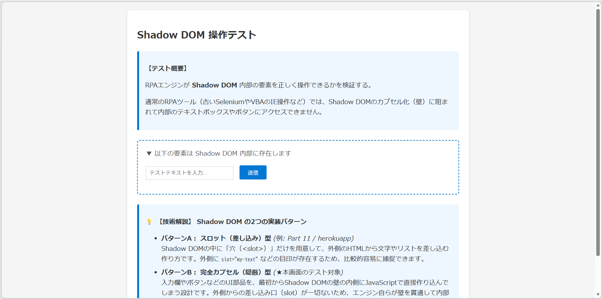
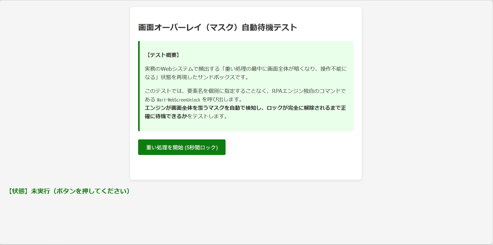

<h4 align="center">コードテスト（公開Webサイト ＆ DOM制御テスト）</h4>

<p align="right">
  更新日: 2026年9月27日<br>
  作成者: System beginner & AI Collaborator (Gemini)
</p>


#### 🧪 公開サイト（_RPA Challengeでのテスト_）
#### 🏆 RPA Challenge（動的フォーム入力ベンチマーク）

RPA業界で世界標準の自動化ベンチマークとして利用されている「[RPA Challenge](https://rpachallenge.com/)」に対する入力テストの実行結果レポートです。

本テストでは、Submit ボタンを押すたびに入力欄（ラベルと input 要素の配置関係）がランダムにシャッフルされる「動的フォーム（Dynamic Form）」に対し、相対XPathを用いて正確にターゲットを追従・入力する制御ロジックの動作検証とミリ秒単位の実測を行いました。

#### 📋 テスト概要 ＆ 仕様一覧

| 項目 | 内容・技術仕様 |
| :--- | :--- |
| **対象サイト** | [https://rpachallenge.com/](https://rpachallenge.com/) |
| **テストデータ** | 10行 × 7列（全70項目）の顧客データ（Arrayからシートへ一括展開可能） |
| **フォーム特性** | Submitごとに各入力項目のDOM配置（位置）が入れ替わる動的レイアウト |
| **位置特定手法** | //label[normalize-space(text())='項目名']/following-sibling::input による動的XPath指定 |
| **ハイライト設定** | (処理速度最優先のため EnableHighlight = False で実行) Ps初期値: True |
| **実測処理時間** | **10,3--.-- ms** （全10ラウンド・70項目入力 ＋ 10回Submit完了） |
| **1ラウンド平均** | **約 1.03 秒** （1項目あたり約 147 ms の高速入力・Submit） |

#### 💡 技術・制御ロジック
#### 1. 動的レイアウトを攻略する「相対XPath」
RPA Challengeでは、ラウンドごとに First Name や Email などの要素位置（IDやCSS階層）が変化するため、固定セレクタでは誤入力が発生します。
本エンジンでは、ラベルテキストを基準として隣接する <input> タグを動的に捉える以下の相対XPathを採用し、配置変更を回避して入力しています。

```vba
' ラベル名「First Name」の兄弟要素である input タグをピンポイント指定
rpaEngine.RunAction "Set-WebXPathTextInput", CreateParams( _
    "XPath", "//label[normalize-space(text())='First Name']/following-sibling::input", _
    "Value", ws.Cells(r, 1).Value)
```

#### 2. デモ用データの自動初期化（ワンクリックセットアップ）
テスト開始時、アクティブシートの見出しを判定し、未セットアップの場合はVBA内部保持の配列（10行×7列）から即座にシートへ展開する自動セットアップ機能を内蔵しています。
    
<details>
  <summary>&emsp;🔍 <i>( ワンクリックセットアップ )</i></summary>

```vba
    ' 確認メッセージの作成
    msg = "【データシートの確認】" & vbCrLf & _
          "アクティブシート（このシート）に、データ準備が［ 未だ ］でしたら、" & vbCrLf & _
          "Array保存データを、アクティブシートへ展開しますが、必要ですか？"
    ' アクティブシートを確認（データシートで無い）
    If ws.Cells(1, 1).Value = "First Name" And ws.Cells(1, 2).Value = "Last Name" Then
        ' データは設定済です。
    Else
        ' はい(Yes)・いいえ(No) の選択肢付きでメッセージを出す
        ans = MsgBox(msg, vbQuestion + vbYesNo, "データ自動展開の確認")
        ' 「はい」が押された場合のみ処理を実行
        If ans = vbYes Then
            Call DeployDataWithHeaderToActiveSheet(ws)
        End If
    End If
```
</details>

#### 📝 まとめ
RPA Challengeのようなシャッフル型動的フォームに対しても、相対XPath（following-sibling）を活用することで、位置ずれによるエラーを起こさず全70項目を約10.3秒（1項目150ms程度）で完走できました。<br>
実務のWebシステム開発において頻発する「画面レイアウトの変更」に対しても、この「要素の相対位置指定」と「パイプ通信による高速制御」の組み合わせが極めて有効であることが確認できました。

---

#### 🌐 公開Webサイト ＆ 特殊DOM

世界標準の自動化テスト用サイト（the-internet.herokuapp.com）やWikipedia、W3C公式サンプル等を対象に、実Web環境における通信遅延・動的描画・特殊DOM（Shadow DOM/PDFビューア/UIA連携）の動作安定性と処理速度をミリ秒単位で実測・評価した検証レポートです。

#### 🧪 公開サイト（_一部、ローカルHTMLを含むテスト_）

<details>
  <summary>&emsp;👉 <i> <b>画面: </b> 10_shadow_dom／Shadow DOM 操作テスト</i></summary>

  

</details>

<details>
  <summary>&emsp;👉 <i> <b>画面: </b> 11_overlay_mask／画面オーバーレイ（マスク）待機テスト</i></summary>

  

</details>

公開サイトでは、テストしづらい箇所を sandbox で再構成しています。<br>

<details>
  <summary>&emsp;🔍 <i> <b>VBA: </b> 公開サイトでのテスト：一般的な</i></summary>

```vba
    prompt = "パートを選んでください：" & vbCrLf & _
            " 0. ** 全パート( 10:UIA除く )一括テスト **" & vbCrLf & _
            " ---" & vbCrLf & _
            " 1. エンジン設定とキャッシュ操作" & vbCrLf & _
            " 2. ナビゲーションと取得系" & vbCrLf & _
            "     ＋ CSSセレクタによる標準DOM操作" & vbCrLf & _
            " 4. XPathによる要素操作" & vbCrLf & _
            " 5. ドロップダウン・チェックボックス" & vbCrLf & _
            " 6. JSネイティブ実行およびCDPネイティブ操作" & vbCrLf & _
            " 7. iframeとタブ(Window)管理" & vbCrLf & _
            " 8. エクスポート・証跡保存・テーブル解析" & vbCrLf & _
            " 9. サイレントダウンロードの正常系テスト" & vbCrLf & _
            " ---" & vbCrLf & _
            "10. UIA(デスクトップ操作) の正常系テスト (メモ帳を使用)"
    ans = InputBox(prompt, "テストパート選択")
```
</details>

<details>
  <summary>&emsp;🔍 <i> <b>VBA: </b> 公開サイトでのテスト：少し高度</i></summary>

```vba
    prompt = "パートを選んでください：" & vbCrLf & _
            " 0. ** 全パート( 21:PDF除く )一括テスト **" & vbCrLf & _
            " ---" & vbCrLf & _
            " 11. Web上の Shadow DOM ページ (テキスト取得)" & vbCrLf & _
            " 12. Virtual Shadow DOM での操作テスト" & vbCrLf & _
            " 13.（マスク）、スピナー・ローディング待機" & vbCrLf & _
            " 14.（PDF） UIA保存テスト（アプローチ検証）" & vbCrLf & _
            " 15. Fetch API によるバイナリのサイレントDL" & vbCrLf & _
            " ---" & vbCrLf & _
            " 21. PDFをブラウザ内蔵ビューアで（注:Adobe Acrobat等）"
    ans = InputBox(prompt, "テストパート選択")
```
</details>

---

&emsp; 👉 [総合テスト・関数一覧表（公開サイト でのテスト）](m04_Engine(%E9%96%A2%E6%95%B0TEST)%E5%85%AC%E9%96%8B%E3%82%B5%E3%82%A4%E3%83%88.md)&emsp;↗️ (docs/)

---

#### 📋 テストシナリオ構成一覧

| パート | テストテーマ | 検証対象・主な技術要素 |
| :--- | :--- | :--- |
| **Part 1** | エンジン設定・キャッシュ | キャッシュ・Cookie全消去（Clear-WebCache）、ハイライト制御 |
| **Part 2** | ナビゲーション・取得 | PageLoad vs DocumentReady 速度比較、URL/タイトル監視待機、タイムアウト検知 |
| **Part 3** | CSSセレクタDOM操作 | 二重待機の自動回避（最適化ノウハウ）、テキスト取得、画面遷移監視 |
| **Part 4** | XPath DOM操作 | XPathによる要素入力・取得・クリック、次画面遷移の確実な消滅監視（Disappear） |
| **Part 5** | フォーム要素制御 | チェックボックス強制制御、ドロップダウンValue指定選択 |
| **Part 6** | CDP・JSネイティブ操作 | WebSocket経由の深層制御（Invoke-CdpScript/Invoke-CdpCommand）、Wikipedia検索 |
| **Part 7** | iframe・タブ管理 | 多段iframe直接アタック、タブ一覧取得（List-Tabs）、アクティブタブ切り替え |
| **Part 8** | 証跡保存・テーブルパース | CSVメモリ保持高速抽出（Export-WebTableToCsv）、全デバッグ証跡（HTML/PNG/CSV）一括生成 |
| **Part 9** | サイレントダウンロード | ダイアログ抑止（Enable-SilentDownload）、拡張子動的切り出し、ファイル確定監視 |
| **Part 10** | UIA（デスクトップ操作） | メモ帳連携、Pattern Mode から Safe Mode (物理操作) への自動フォールバック検証 |
| **Part 11** | Web Shadow DOM | スロット型 Shadow DOM の捕捉、XPath限界（壁）の実証と CSS属性指定による突破 |
| **Part 12** | Virtual Shadow DOM | 完全カプセル化（隠蔽型）Shadow DOM に対する deepQuerySelector 貫通テスト |
| **Part 13** | マスク・ローディング待機 | Wait-WebScreenUnlock（5秒マスク）、スピナー消滅監視、動的ローディング待機比較 |
| **Part 14** | PDF UI操作の限界検証 | ブラウザ内蔵PDFプラグインに対する UIA / SendKeys 操作がブロックされる現象の実証 |
| **Part 15** | Fetch API サイレントDL | UI操作を回避し、Test-WebElement 事前分岐 ＋ Fetch API による高速サイレント保存 |
| **Part 21** | ブラウザ内蔵PDFビューア | <embed> タグからの絶対URL自動抽出（Get-WebEmbedPdfUrl）と Fetch DL 連動 |

---

#### 1. 【第1部】 基礎・汎用コンポーネント動作テスト (Part 1 ～ Part 10)

#### 1-1. ページロード待機ベンチマーク ＆ 監視待機 (Part 2)
画面: https://the-internet.herokuapp.com/login<br>

実通信が発生するWebサイトにおいて、PageLoad と DocumentReady の処理時間を実測比較しました。

```vba
' --- DOMツリー構築完了のみを高速待機 (666.06 ms) ---
rpaEngine.RunAction "Wait-WebDocumentReady", CreateParams("TimeoutSec", 10)

' --- 画像・全リソース・通信沈静化を含めて完全待機 (4287.84 ms) ---
rpaEngine.RunAction "Wait-WebPageLoad"
```

💡 _**実測比較データ**_<br>
•	**Wait-WebPageLoad** : 4,287.84 ms （全画像・外部リソース読込完了まで待機）<br>
•	**Wait-WebDocumentReady** : 666.06 ms （約6倍高速。DOM構造完成時点で即時復帰）<br>
•	**Wait-WebUrlContains** : 157.85 ms （SPAや非同期画面更新における目的URL到達をポーリング検知）<br>
•	**Wait-WebTitleContains** : 325.28 ms （ページタイトル書き換えを正確に捕捉）<br>

#### 1-2. パフォーマンス最適化：二重待機の自動回避 (Part 3 & Part 4)
主要なアクション関数（Set-WebTextInput、Invoke-WebClick、Set-WebXPathTextInput 等）は、関数内部に「**要素出現待機（Wait-WebElement）**」を標準内包しています。

> [!TIP]
> **RPA開発のパフォーマンス最適化:** 
VBA側で直前に明示的な Wait-WebElement を呼ぶと、2回の通信往復（二重待機）が発生してオーバーヘッド（約200ms〜220ms）が生じます。操作対象が明確な場合は、事前Waitを省略して直接アクション関数を呼び出すことでミリ秒単位の短縮が可能です。

#### 1-3. CDP（Chrome DevTools Protocol）深層制御 (Part 6) <br>
対象: **https://ja.wikipedia.org/**<br>
WebSocket通信ポート（9222）を介して、DOMの枠組みを超えたブラウザ本体の低レイテンシ制御を実施。

```vba
' WebSocket通信によるJavaScriptの直接評価（DOM非依存）
resText = rpaEngine.RunAction("Invoke-CdpScript", CreateParams("Js", "return document.title;"))

' JSON-RPCコマンドによるブラウザ本体バージョンの直接取得
resText = rpaEngine.RunAction("Invoke-CdpCommand", CreateParams("Method", "Browser.getVersion"))

' CDP経由のネイティブ入力とクリック（UIイベントを介さない直接注入）
rpaEngine.RunAction "Set-CdpNativeTextInput", CreateParams("Selector", "#searchInput", "Value", "RPA")
rpaEngine.RunAction "Invoke-CdpNativeClick", CreateParams("Selector", "#searchform button")
```

#### 1-4. UIA（Desktop UI Automation）自動フォールバック構造 (Part 10)
対象: **Notepad（メモ帳）/ OS保存ダイアログ**<br>
Windows 11等において、アプリ側の内部API（Pattern モード）が操作を拒否した場合、エンジンが非対応を自動検知して物理エミュレート（Safe モード）へ自律的にフォールバック（救済）する安全機構を実証しました。

```vba
[VBA] Invoke-UiaAction (Mode="Pattern", Value="PatternInput.txt")
        │
        ▼ (UIA内部API呼び出し)
[LOG] <Warning> ValuePattern非対応のため、Safeモード(物理入力)へ自動フォールバックします。
        │
        ▼ (物理キーボード入力シミュレーション実行)
[SUCCESS] 入力完了 (確実な自動補正動作を達成)
```

---

#### 【第2部】 高度なDOM・ダウンロード・待機制御テスト (Part 11 ～ Part 21)
#### 2-1. Shadow DOM の壁と突破手法 (Part 11 & Part 12)

**【検証1】 スロット型 Shadow DOM (Part 11)** <br>
画面: https://the-internet.herokuapp.com/shadowdom<br>
Shadow DOM（#shadow-root）の内部に対し、通常の XPath 検索を実行するとブラウザのアクセス制限に阻まれ、意図通りタイムアウト例外が発生します。

```text
[ログ出力結果]
VBA -> PS: {"Command":"Wait-WebXPathElement","Parameters":{"XPath":"//my-paragraph//p","TimeoutSec":3}}
PS_STDOUT: [ERROR][Wait-Condition] [Timeout]: [Wait-WebXPathElement] タイムアウト: XPath要素が見つからない
 >> 想定通り、XPathではShadow DOMの壁に阻まれエラーになりました。
```

💡 **突破ロジック**
外側から Shadow DOM へテキストを流し込む差し込み口 <span slot="my-text"> の属性を捕捉し、CSSセレクタ指定（span[slot='my-text']）でアプローチすることで、要素テキスト（Let's have some different text!）の取得に成功しました。<br>

**【検証2】 カプセル化（隠蔽型） Shadow DOM (Part 12)** <br>
画面: **sandbox/10_shadow_dom.html**<br>
差し込み口（slot）を持たず、Shadow DOM の内部に直接埋め込まれた不可視要素（#shadow-input, #shadow-btn）に対し、自作エンジンの deepQuerySelector が再帰的に shadowRoot を貫通・捕捉し、値の注入とクリックを成功させました。

```vba
' 貫通入力 ＆ 貫通クリック
rpaEngine.RunAction "Set-WebTextInput", CreateParams("Selector", "#shadow-input", "Value", "ShadowDOM テストOK")
rpaEngine.RunAction "Invoke-WebClick", CreateParams("Selector", "#shadow-btn")
' 結果取得: "入力値は: ShadowDOM テストOK"
```

#### 2-2. マスク・スピナー・動的ローディング待機 (Part 13)
画面描画中の空振りクリック事故を防ぐため、多様な待機APIの挙動と所要時間を実測検証しました。

<!-- 2. マスク・スピナー・動的ローディング待機比較表（Part 13） -->
| 待機API | 監視対象・画面 | 実測所要時間 | 判定基準・動作特性 |
| :--- | :--- | :--- | :--- |
| **Wait-WebScreenUnlock** | オーバーレイ（11_overlay_mask） | **5,111.13 ms** | 画面全体のグレーアウト・ブロック膜の消滅を自動検出 |
| **Wait-WebElementInvisible** | スピナー（spinners） | **167.10 ms** | CSS #spinner 要素の非表示化（display:none / 可視性消失） |
| **Wait-WebElementInvisible** | Loading（dynamic_loading/1） | **5,061.77 ms** | 非同期処理中のオーバーレイ #loading の消滅待機 |
| **Wait-WebXPathElementDisappear**| Loading（dynamic_loading/1） | **5,549.55 ms** | XPath //div[@id='loading'] のDOM上からの完全消失待機 |

#### 2-3. PDF保存における「UI操作の限界」と「Fetch API」の優位性 (Part 14 vs Part 15 & 21)
❌ **UI操作・UIAアプローチの限界 (Part 14)**<br>
画面: https://www.w3.org/WAI/ER/tests/xhtml/testfiles/resources/pdf/dummy.pdf<br>
Chromium（Edge/Chrome）のブラウザ内蔵PDFビューアは独立したプラグインプロセス（PDFium等）で描画されます。そのため、UIA（UI Automation）や SendKeys（Ctrl+S, +{F10}）による保存試行は、アクセシビリティツリーの応答停止によりすべてブロック・タイムアウト（[未発見]: 保存ダイアログのウィンドウが見つかりませんでした）となりました。

⭕ **解決策：Fetch API ＋ URL自動抽出によるサイレント取得 (Part 15 & Part 21)**<br>
UI操作を全面的に放棄し、DOMの裏側からネットワーク通信層（Fetch API）経由でバイナリを直接取得する手法へ切り替えることで、安定した高速ダウンロードを実現します。

```vba
' 1. 安全な分岐判定 (要素不揃いによるエラー中断を防ぐ)
isExist = rpaEngine.RunAction("Test-WebElement", CreateParams("Selector", "a[href$='.pdf']", "TimeoutSec", 3))

If isExist = "True" Then
    ' 2. 対象PDFのURL属性(href)を取得
    pdfHref = rpaEngine.RunAction("Get-WebAttribute", CreateParams("Selector", "a[href$='.pdf']", "Attribute", "href"))
    
    ' 3. ダイアログ抑止予約 ＆ Fetch APIによる裏側からのセッション維持バイナリ取得
    rpaEngine.RunAction "Enable-SilentDownload", CreateParams("DownloadDirectory", saveDir, "FileName", saveFileName)
    rpaEngine.RunAction "Invoke-WebFetchDownload", CreateParams("TargetUrl", pdfHref)
    
    ' 4. 一時ファイル(.crdownload)消失とロック解除監視 (所要時間: 336.57 ms)
    rpaEngine.RunAction "Wait-FileDownload", CreateParams("FilePath", fullSavePath, "TimeoutSec", 30)
End If
```

💡 **ブラウザ直開きの <embed> PDF対策 (Part 21)**<br>
PDFの直リンク画面では、Get-WebEmbedPdfUrl 命令を呼び出すことで <embed> タグが隠し持つ内部URL（https://.../dummy.pdf）を動的に自動抽出。そのまま Fetch API へ受け渡すことで、ダイアログを表示させることなく直接ファイルとして保存（サイレント完了）できます。

---

#### 3. 📊 実測パフォーマンス検証サマリー(結構古い私のノートPC)
イミディエイトウィンドウに出力された全測定命令の実測処理時間一覧（参考タイム）です。

```text
========================================================================================
【 Part 2 : ナビゲーション・待機速度 】
  - Wait-WebPageLoad                 : 4,287.84 ms (全リソースロード完了)
  - Wait-WebDocumentReady            :   666.06 ms (DOMツリー解析完了)
  - Wait-WebUrlContains              :   157.85 ms (URL文字列照合完了)
  - Wait-WebTitleContains            :   325.28 ms (タイトル文字列照合完了)

【 Part 3 / Part 4 : DOM要素操作オーバーヘッド 】
  - Wait-WebElement (CSS)            :   220.90 ms (単体待機時間)
  - Wait-WebXPathElement (XPath)     :   165.70 ms (単体待機時間)

【 Part 8 : テーブルパース速度 】
  - Export-WebTableToCsv (メモリ)    :   176.75 ms (5行データの配列取得)

【 Part 9 / 13 / 15 : ダウンロード ＆ 待機制御 】
  - Wait-FileDownload (標準DL)      : 1,773.40 ms (ブラウザ通常DL完了監視)
  - Wait-WebScreenUnlock             : 5,111.13 ms (画面マスク解除監視)
  - Wait-WebElementInvisible (スピナ):  167.10 ms (スピナー消滅監視)
  - Wait-WebElementInvisible (Load)  : 5,061.77 ms (CSSローディング消滅監視)
  - Wait-WebXPathElementDisappear    : 5,549.55 ms (XPathローディング消滅監視)
  - Invoke-WebFetchDownload          :   336.57 ms (Fetch APIサイレント取得)
========================================================================================
```

4. 要素の特定と堅牢な操作アプローチ（参考）

```vba
' --- クリック＆ダイアログ/Ajax（部分更新）待機 ---
Private Sub Click_AndWaitDialog(ByVal xpathStr As String, Optional ByVal waitMs As Long = 500)
    rpaEngine.RunAction "Invoke-WebXPathClick", CreateParams("XPath", xpathStr)
    rpaEngine.RunAction "Wait-WebDocumentReady", CreateParams("TimeoutSec", 10)
    Call xxx_MaskUnlock
    rpaEngine.RunAction "Wait-WebScreenUnlock", CreateParams("TimeoutSec", c_TimeoutSec)
    If waitMs > 0 Then Sleep waitMs
End Sub

' --- (xxxシステム)マスク解除待機 ---
Private Sub xxx_MaskUnlock()
    Dim maskXPath As String
    maskXPath = "//*[@id='opmask' or @id='opFreezePane' or @id='mask']"
    rpaEngine.RunAction "Wait-WebXPathElementDisappear", CreateParams("XPath", maskXPath, "TimeoutSec", c_TimeoutSec)
End Sub
```

---

5. おわりに<br>
本検証により、実Webサイトにおける処理速度の最適化（DocumentReady やアクション内包待機の活用）、ならびにRPAの弱点であった「Shadow DOM」「画面マスク」「ブラウザ内蔵PDFビューア」に対する解決アーキテクチャ（deepQuerySelector / Wait-WebScreenUnlock / Fetch API）の実用性が確認できました。
